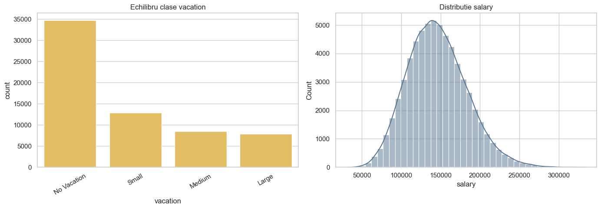
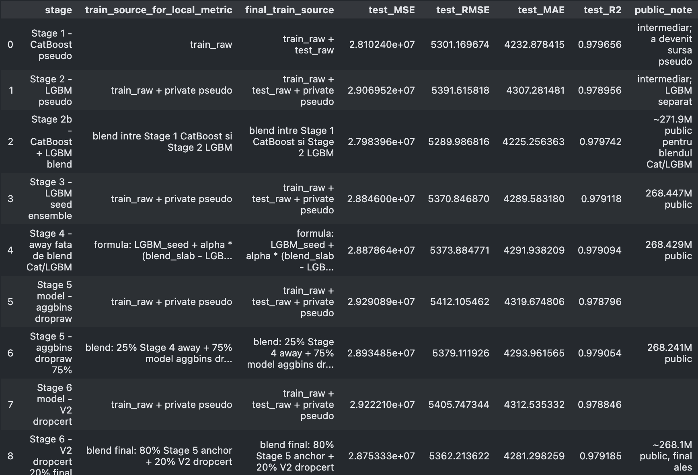
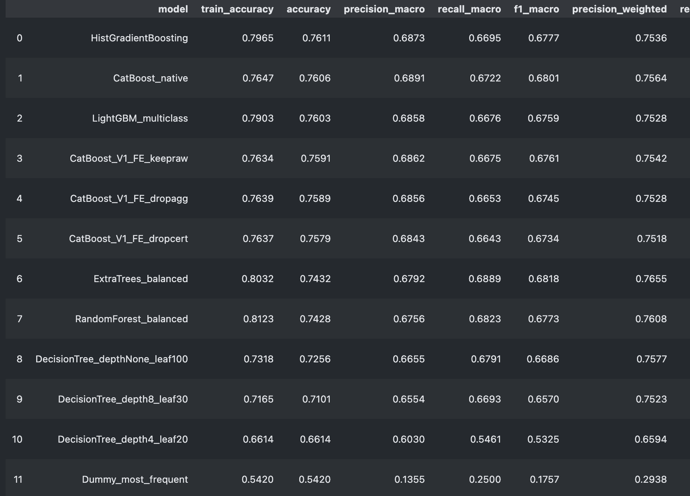
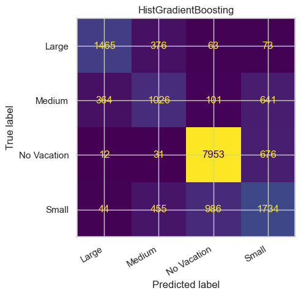
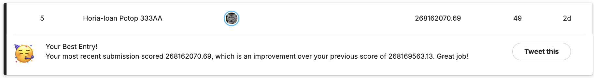
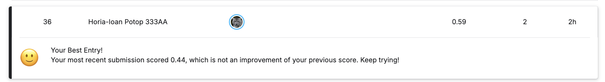

# Kaggle Regression & Classification

A clean, public-facing Kaggle-style machine learning project for two supervised learning tasks on the same tabular dataset:

- **Regression:** predict `salary`
- **Classification:** predict the `vacation` class

The project walks from exploratory analysis and simple baselines to stronger tabular models, feature engineering, validation checks, and final submission files.

## Highlights

| Task | Final model direction | Local result |
| --- | --- | --- |
| Regression | log-target modeling, target encoding, pseudo-labeling, LightGBM-style seed ensembling, data-centric feature variants | MSE `2.8753e7`, RMSE `5362.21`, MAE `4281.30`, R2 `0.9792` |
| Classification | HistGradientBoosting selected by local accuracy, with CatBoost/LightGBM/ExtraTrees comparisons | Accuracy `0.7611`, macro F1 `0.6777`, weighted F1 `0.7568` |

Final files ready for upload are stored in [`submissions/`](submissions/):

- [`submission_regression_final.csv`](submissions/submission_regression_final.csv)
- [`submission_classification_final.csv`](submissions/submission_classification_final.csv)

## Visual Overview

| Target distributions | Regression progression |
| --- | --- |
|  |  |

| Classification comparison | Confusion matrix |
| --- | --- |
|  |  |

## Repository Structure

```text
.
|-- assets/figures/          # plots and Kaggle screenshots used in the README
|-- data/                    # train, local test, and private test CSV files
|-- notebooks/main.ipynb     # main reproducible notebook
|-- results/
|   |-- classification/      # metrics, reports, confusion matrix, baseline submission
|   `-- regression/          # selected baseline and staged regression submissions
|-- submissions/             # final upload-ready CSV files
|-- requirements.txt
`-- README.md
```

## Workflow

1. **Explore the data**
   - inspect numeric and categorical distributions
   - check missing values, outliers, redundancy, and target imbalance
   - use Cramer's V / chi-square style association for categorical relationships

2. **Build regression models**
   - start with `LinearRegression`, Ridge, Lasso, and ElasticNet baselines
   - move to stronger tree/boosting models with log-transformed target
   - add target encoding, interaction features, pseudo-labeling, adversarial validation checks, and seed ensembling

3. **Build classification models**
   - start with `DecisionTreeClassifier` and a dummy baseline
   - compare RandomForest, ExtraTrees, HistGradientBoosting, LightGBM, and CatBoost
   - evaluate with accuracy, macro metrics, weighted metrics, per-class metrics, and a confusion matrix

4. **Generate submissions**
   - regression output: `id,prediction` with continuous salary predictions
   - classification output: `id,prediction` with vacation class labels

## Results

### Regression

The linear baseline is strong but limited by nonlinear interactions between role, education, location, experience, company attributes, and the shifted private-test distribution.

The final regression direction uses:

- `log1p` target transformation
- categorical interaction features
- target encoding without leakage
- pseudo-labeling on the private test distribution with reduced sample weight
- seed ensembling and data-centric feature variants

The final regression submission has `16,000` rows, prediction mean `156,985.47`, and prediction range `42,531.87` to `311,244.94`.



### Classification

The selected classifier is `HistGradientBoosting`, chosen by local accuracy. CatBoost is very close and slightly stronger on some macro metrics, which is useful context because the class distribution is imbalanced.

Final private-test prediction distribution:

| Class | Count |
| --- | ---: |
| No Vacation | 5,452 |
| Small | 4,522 |
| Medium | 3,397 |
| Large | 2,629 |



## Reproduce Locally

Create an environment and install dependencies:

```bash
python3 -m venv .venv
source .venv/bin/activate
pip install -U pip
pip install -r requirements.txt
```

Run the notebook:

```bash
jupyter lab notebooks/main.ipynb
```

The notebook detects the repository root automatically, so it can be opened from the repo root or from the `notebooks/` folder. Outputs are written to `results/` and `submissions/`.

## Key Files

- [`notebooks/main.ipynb`](notebooks/main.ipynb): full EDA, modeling, evaluation, and submission generation
- [`results/regression/REGRESSION_CSV_INDEX.csv`](results/regression/REGRESSION_CSV_INDEX.csv): selected regression artifacts
- [`results/classification/CLASSIFICATION_CSV_INDEX.csv`](results/classification/CLASSIFICATION_CSV_INDEX.csv): selected classification artifacts
- [`submissions/SUBMISSION_INDEX.csv`](submissions/SUBMISSION_INDEX.csv): compact summary of final upload files
