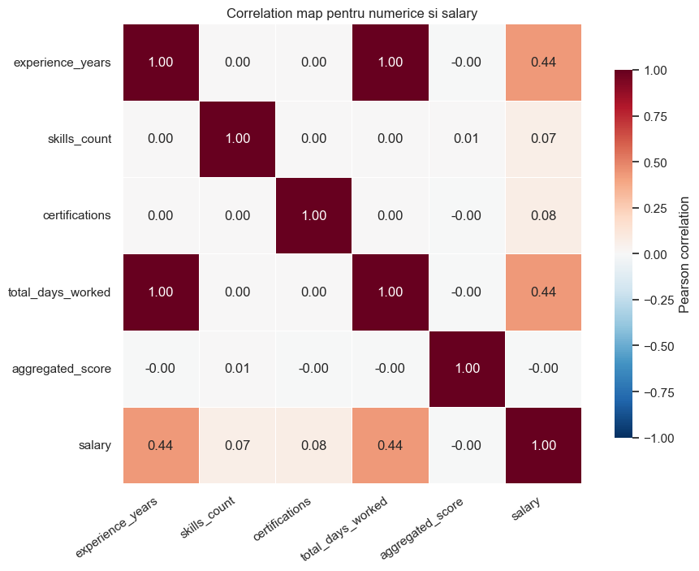
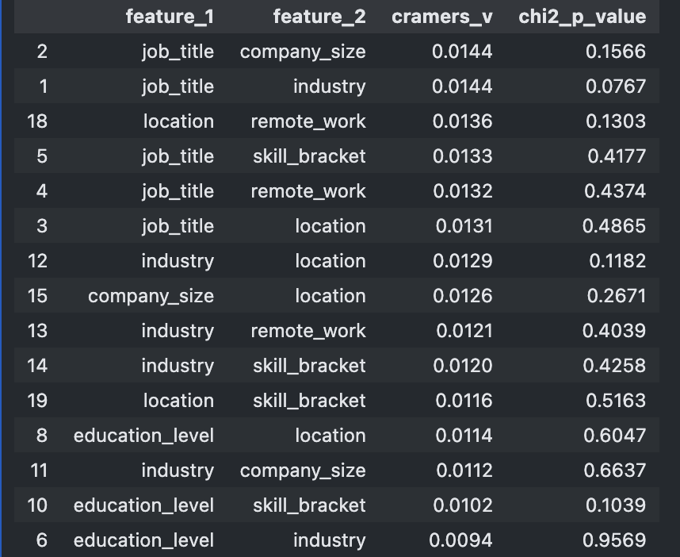

# Kaggle Regression & Classification

Public Kaggle-style machine learning project for two tabular prediction tasks on the same education/economy dataset:

- **Regression:** predict employee `salary`
- **Classification:** predict the `vacation` class

The repository is organized as a clean GitHub presentation: one main notebook, curated results, final Kaggle-ready submissions, and visual evidence of the submitted runs. The work starts from interpretable baselines and moves toward stronger tabular ML pipelines with feature engineering, validation, and model comparison.

## Project Description

This project solves two supervised learning problems from the same dataset. The regression track focuses on salary prediction, where the strongest solution uses log-target modeling, target encoding, pseudo-labeling, and ensemble-style refinements. The classification track predicts the vacation category, where several tree and boosting models are compared under class imbalance.

Both final submission files were generated for Kaggle and are kept in [`submissions/`](submissions/). The README includes Kaggle screenshots and the main validation metrics so the result quality is visible directly from the repository page.

## Results At A Glance

| Task | Final direction | Main local validation result | Kaggle artifact |
| --- | --- | --- | --- |
| Salary regression | log target, target encoding, pseudo-labeling, LightGBM-style seed ensembling, data-centric feature variants | MSE `2.8753e7`, RMSE `5362.21`, MAE `4281.30`, R2 `0.9792` | [`submission_regression_final.csv`](submissions/submission_regression_final.csv) |
| Vacation classification | HistGradientBoosting selected by local accuracy; CatBoost, LightGBM, ExtraTrees also compared | Accuracy `0.7611`, macro F1 `0.6777`, weighted F1 `0.7568` | [`submission_classification_final.csv`](submissions/submission_classification_final.csv) |

Regression achieved a strong Kaggle public score around `268M`, after improving from earlier variants around `273M`. For classification, the final submission keeps a healthy class distribution instead of collapsing into the majority class, while maintaining the best local accuracy among the tested models.

## Kaggle Submissions

The final CSV files are stored separately from intermediate experiments:

| File | Rows | Format | Summary |
| --- | ---: | --- | --- |
| [`submission_regression_final.csv`](submissions/submission_regression_final.csv) | 16,000 | `id,prediction` | mean prediction `156,985.47`, range `42,531.87` to `311,244.94` |
| [`submission_classification_final.csv`](submissions/submission_classification_final.csv) | 16,000 | `id,prediction` | `No Vacation`, `Small`, `Medium`, `Large` predictions |

| Regression Kaggle run | Classification Kaggle run |
| --- | --- |
|  |  |

## Visual Summary

| Target distributions | Numeric relationships |
| --- | --- |
|  |  |

| Regression improvement stages | Classification model comparison |
| --- | --- |
|  |  |

| Categorical association | Final confusion matrix |
| --- | --- |
|  |  |

## Repository Structure

```text
.
|-- assets/
|   `-- figures/                 # plots and Kaggle screenshots shown in README
|-- data/
|   |-- CC_education_economy_train.csv
|   |-- CC_education_economy_test.csv
|   `-- CC_private_test.csv
|-- notebooks/
|   `-- main.ipynb               # full EDA, modeling, validation, submissions
|-- results/
|   |-- classification/          # metrics, reports, confusion matrix, baseline submission
|   `-- regression/              # selected baseline and staged regression outputs
|-- submissions/
|   |-- SUBMISSION_INDEX.csv
|   |-- submission_classification_final.csv
|   `-- submission_regression_final.csv
|-- requirements.txt
`-- README.md
```

## Dataset Role

| File | Role |
| --- | --- |
| [`data/CC_education_economy_train.csv`](data/CC_education_economy_train.csv) | labeled training set |
| [`data/CC_education_economy_test.csv`](data/CC_education_economy_test.csv) | labeled local validation/test set |
| [`data/CC_private_test.csv`](data/CC_private_test.csv) | unlabeled Kaggle/private-test set used for final submissions |

The two targets are handled separately to avoid leakage:

- `salary` is the regression target and is not used as a feature in classification.
- `vacation` is the classification target and is not used as a feature in regression.
- `id` is kept only for submission formatting.

## Modeling Workflow

### 1. Exploratory Data Analysis

The notebook checks:

- numeric distributions and outliers
- missing values, especially in `remote_work`
- target distributions for `salary` and `vacation`
- feature redundancy, including the relation between `experience_years` and `total_days_worked`
- categorical associations using Cramer's V / chi-square style analysis

### 2. Regression Pipeline

The regression work progresses from simple to stronger models:

1. Linear baseline with `LinearRegression`
2. Regularized baselines with Ridge, Lasso, and ElasticNet
3. Log-target modeling for salary
4. Interaction features and target encoding
5. Adversarial validation to diagnose train/private-test drift
6. Pseudo-labeling with reduced private-test weight
7. Seed ensembling and data-centric feature variants

Representative staged outputs are kept in [`results/regression/`](results/regression/), while the final upload file is kept in [`submissions/`](submissions/).

### 3. Classification Pipeline

The classification workflow compares multiple model families:

1. `DummyClassifier` as a minimum sanity baseline
2. `DecisionTreeClassifier` with several depth/leaf configurations
3. RandomForest and ExtraTrees for robust tree ensembles
4. HistGradientBoosting for the final selected local-accuracy model
5. LightGBM and CatBoost for stronger tabular alternatives

The final model was selected by local accuracy, while macro metrics were also inspected because the classes are imbalanced.

## Detailed Results

### Regression

| Stage | Local MSE | RMSE | MAE | R2 | Note |
| --- | ---: | ---: | ---: | ---: | --- |
| Linear/Lasso baseline | `5.4935e7` | `7411.82` | `5731.04` | `0.9602` | strong interpretable baseline |
| CatBoost pseudo-labeling | `2.8102e7` | `5301.17` | `4232.88` | `0.9797` | first major jump |
| LGBM seed ensemble | `2.8846e7` | `5370.85` | `4289.58` | `0.9791` | stronger Kaggle public behavior |
| Final V2/drop-cert blend | `2.8753e7` | `5362.21` | `4281.30` | `0.9792` | final selected submission direction |

### Classification

Top local classification models:

| Model | Accuracy | Macro precision | Macro recall | Macro F1 | Weighted F1 |
| --- | ---: | ---: | ---: | ---: | ---: |
| HistGradientBoosting | `0.7611` | `0.6873` | `0.6695` | `0.6777` | `0.7568` |
| CatBoost native | `0.7606` | `0.6891` | `0.6722` | `0.6801` | `0.7581` |
| LightGBM multiclass | `0.7603` | `0.6858` | `0.6676` | `0.6759` | `0.7559` |
| ExtraTrees balanced | `0.7432` | `0.6792` | `0.6889` | `0.6818` | `0.7519` |

Final private-test prediction distribution:

| Class | Count | Percent |
| --- | ---: | ---: |
| No Vacation | 5,452 | 34.08% |
| Small | 4,522 | 28.26% |
| Medium | 3,397 | 21.23% |
| Large | 2,629 | 16.43% |

## Reproduce Locally

Create a virtual environment and install dependencies:

```bash
python3 -m venv .venv
source .venv/bin/activate
pip install -U pip
pip install -r requirements.txt
```

Run the notebook:

```bash
jupyter lab notebooks/main.ipynb
```

The notebook detects the repository root automatically, so it can be opened from the repo root or directly from the `notebooks/` folder. It writes generated outputs to `results/` and `submissions/`.

## Key Artifacts

| Artifact | Description |
| --- | --- |
| [`notebooks/main.ipynb`](notebooks/main.ipynb) | main analysis and modeling notebook |
| [`results/regression/REGRESSION_CSV_INDEX.csv`](results/regression/REGRESSION_CSV_INDEX.csv) | index of selected regression outputs |
| [`results/classification/CLASSIFICATION_CSV_INDEX.csv`](results/classification/CLASSIFICATION_CSV_INDEX.csv) | index of selected classification outputs |
| [`submissions/SUBMISSION_INDEX.csv`](submissions/SUBMISSION_INDEX.csv) | compact summary of final submission files |
| [`requirements.txt`](requirements.txt) | Python dependencies for local reproduction |

## Main Takeaways

- Linear regression gives a solid baseline, but boosted/tabular models capture interactions much better.
- Regression performance improved most from distribution-aware choices: log target, target encoding, pseudo-labeling, and careful feature variants.
- Classification is affected by class imbalance, so accuracy alone is not enough; macro F1 and the confusion matrix are also important.
- The final repository keeps only the useful public presentation artifacts: notebook, selected results, screenshots, and upload-ready submissions.
